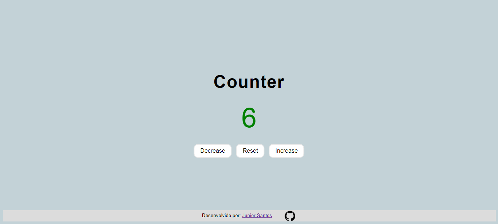

# Counter

O presente aplicativo tem como objetivo ser um contador.
Nele é possível incrementar, decrementar ou resetar o valor.
Além disso, valores positivos possuem a cor verde, enquanto que valores negativos são vermelhos.



## Como executar

Utilizar o terminar ou qualquer interpretador de python 3.
Exemplo do comando para o terminal do Ubuntu:

```bash
python3 -m http.server
```

> Atualizar o comando de acordo com o interpretador ou sistema operacional utilizado.

## Forma alternativa

Executar o arquivo 'index.html' em qualquer navegador.