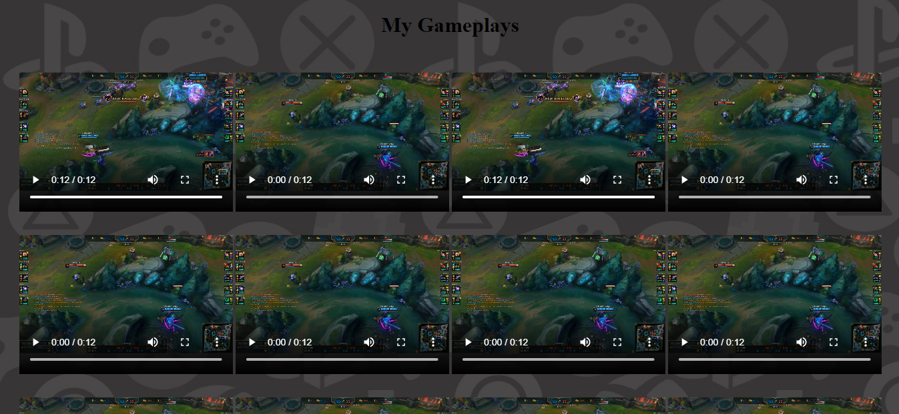

# Mosaic Video

O presente repositório trata-se de uma demo simplificada de site com exibição centralizada de video,
semelhante a uma exposição em forma de mosaico.



## Como executar

Utilizar o terminar ou qualquer interpretador de python 3.
Exemplo do comando para o terminal do Ubuntu:

```bash
python3 -m http.server
```

> Atualizar o comando de acordo com o interpretador ou sistema operacional utilizado.

## Forma alternativa

Executar o arquivo 'index.html' em qualquer navegador.