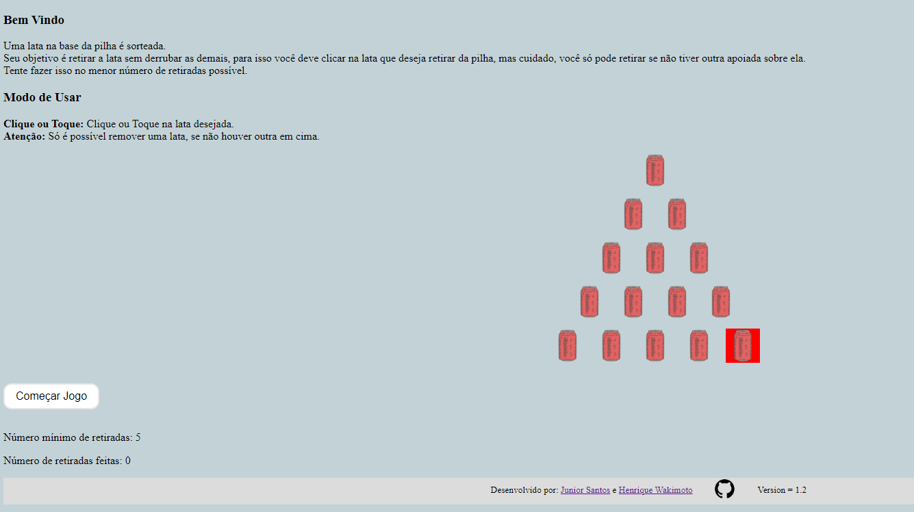

# Pilha de Lata

A matemática pode ser muito interessante.

Qual o menor número de latas é necessário mover?



Um programa que busca simular uma questão da OBMEP.

Qual é o menor numero de latas que precisa ser retirada antes de pegar a lata indicada em vermelho ?

## Execução

Para executar o programa, basta seguir o passo:

### 1 - Clonar o repositório

Clone o repositório para a sua máquina local.

Você pode realizar essa operação exeutando os comandos a baixo em um Terminal Linux:

```bash
git clone https://github.com/jr-santos98/unique-composition.git
cd unique-composition/09-stack-cans
```

### 2 - Execute o arquivo index.html

Abra o arquivo 'index.html' no navegador de sua preferência.

### 3 - Divirta-se

Siga as instruções e divirta-se! :wink:
