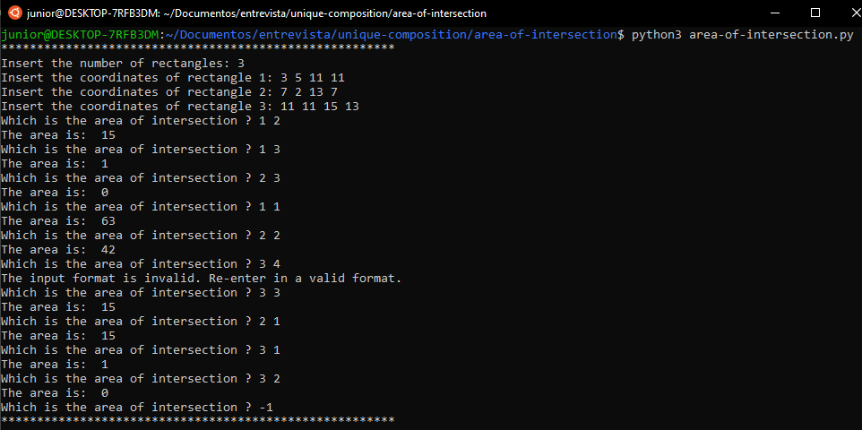

# Which is the area of intersection ?

O pacote foi desenvolvido com o objetivo de calcular a área de insersecção dado Xn retângulos,
sendo n >= 2. Dessa forma, o pacote cálcula, se existir, a área de insersecção entre n1 e n2.



> O pacote possui grande parte do código utilizado em: "rectangles-intersect".

## Requisitos

É requisitado a instalação do(s) seguinte(s) componente(s):

- Python 3.

## Como executar

Utilizar o terminar ou qualquer interpretador de python 3.
Exemplo do comando para o terminal do Ubuntu:

```bash
python3 validate-CNPJ.py
```

> Atualizar o comando de acordo com o interpretador ou sistema operacional utilizado.

## Funcionamento - Entradas suportadas

Assim que o programa inicia, ele solicita que seja informado o número de retângulos.
Após isso, será solicitado as coordenadas dos n retângulos informados.

### Entrada dos retângulos

Os retângulos são compostos por 2 pontos opostos, separados pelo ângulo reto.
Os pontos devem ser infomados na mesma linha separados por espaço na forma:

`X Y X' Y'`

> Caso as coordenadas não sejam inseridas de acordo com a forma acima,
será retornado a mensagem: "The input format is invalid. Re-enter in a valid format.",
sendo solicitado os dados novamente.

### Calculando área

Quando o programa enviar a mensagem: "Which is the area of intersection ?"
Significa que ele está pronto para receber os retangulos a serem comparados.

Para verificar área da intersecção, inserira o número de 2 retângulos separados por espaço.
Para sair do programa use o comando: "-1"

> Se for informado uma númeração inexistente ou em outro formato,
a mensagem será apresentada: "The input format is invalid. Re-enter in a valid format.".

## Saída esperada

Logo após inserir as figuras a serem comparadas, já será informado
o valor da área correpondente.

```bash
Which is the area of intersection ? 1 2
The area is:  15
```

> O valor 0 pode significar que não existe intersecção entre os retângulos solicitados.