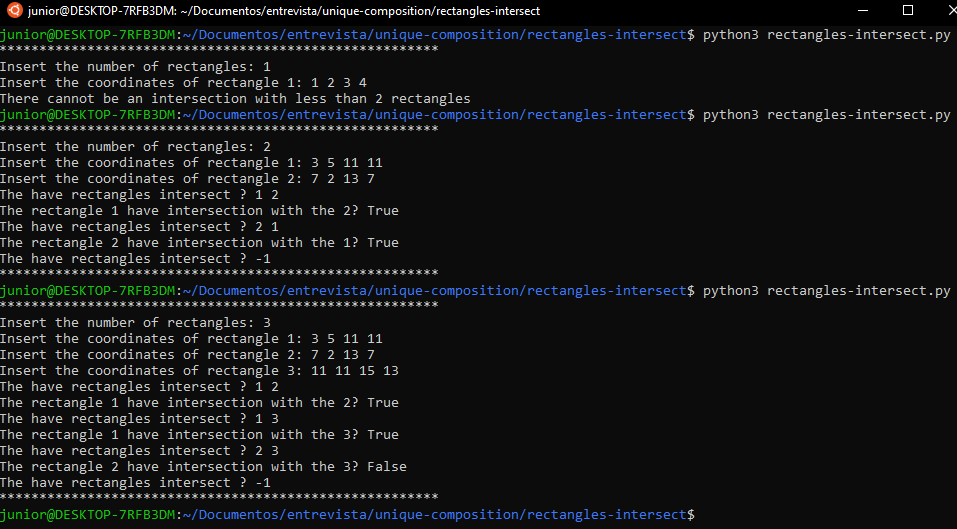
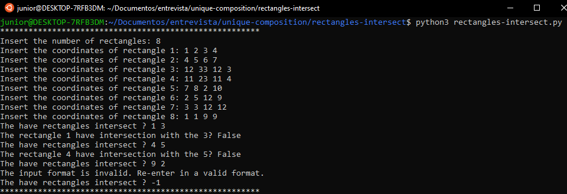

# The have rectangles intersect ?

O pacote foi desenvolvido com o objetivo de verificar se dado Xn retângulos,
sendo n >= 2. Verifica se n1 e n2 se interceptam.

## Requisitos

É requisitado a instalação do(s) seguinte(s) componente(s):

- Python 3.

## Como executar

Utilizar o terminar ou qualquer interpretador de python 3.
Exemplo do comando para o terminal do Ubuntu:

´python3 validate-CNPJ.py´.

> Atualizar o comando de acordo com o interpretador ou sistema operacional utilizado.

## Funcionamento - Entradas suportadas

Assim que o programa inicia, ele solicita que seja informado o número de retângulos.
Após isso, será solicitado as coordenadas dos n retângulos informados.

### Entrada dos retângulos

Os retângulos são compostos por 2 pontos opostos, separados pelo ângulo reto.
Os pontos devem ser infomados na mesma linha separados por espaço na forma: ´X Y X' Y'´

> Caso as coordenadas não sejam inseridas de acordo com a forma acima,
será retornado a mensagem: "The input format is invalid. Re-enter in a valid format.",
sendo solicitado os dados novamente.

### Verificando intersecção

Quando o programa enviar a mensagem: "The have rectangles intersect ?"
Significa que ele está pronto para receber os retangulos a serem comparados.

Como pode ser visto na imagem a cima, cada retatângulo possui uma numeração.
Para verificar a intersecção, basta inserir o número de 2 retângulos separados por espaço.

Para sair do programa basta usar o comando: "-1"

> Se for informado uma númeração inesistente ou em outro formato,
a mensagem será apresentada: "The input format is invalid. Re-enter in a valid format.".

## Saída esperada

Logo após inserir as figuras a serem comparadas, já será informado
True ou False para a existência de uma insersecção.

´´´The have rectangles intersect ? 1 3
The rectangle 1 have intersection with the 3? False´´´